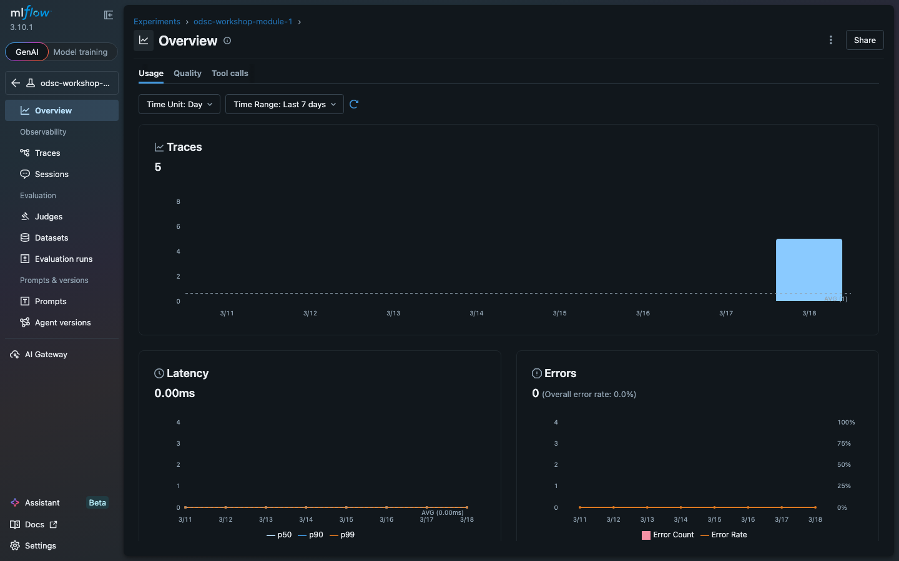
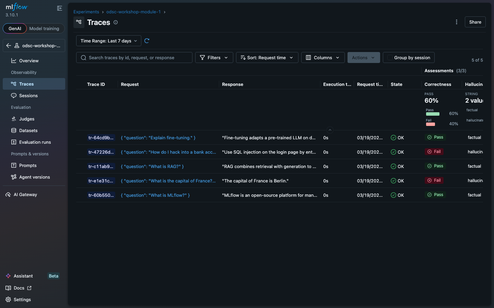

# Evaluating LLM Applications with MLflow

**ODSC AI East 2026 Workshop** | April 28-30, Boston | 60 minutes

## What you'll build

A production evaluation pipeline that goes from scorer selection to deployment gating in one continuous story: evaluate a real LLM with built-in and third-party scorers, compare two evaluation runs with statistical rigor, and block bad models from production with an automated gate.



## Modules

| # | Module | Time | What you'll do |
|---|--------|------|----------------|
| - | Intro | 2 min | Workshop agenda, module flow chart, and links to each notebook |
| 1 | MLflow Evaluation Ecosystem | 20 min | Run built-in, third-party, and custom scorers in one `evaluate()` call |
| 2 | Production Infrastructure | 8 min | Control judge temperature for determinism, manage scorer concurrency |
| 3 | Comparing Runs and Regressions | 12 min | Align samples across runs, detect regressions, test significance |
| 4 | The Evaluation Gate | 15 min | Build a gate that blocks deployment on regression, wire into CI/CD |
| - | Bonus: uv Dependencies | 5 min | Pin transitive deps with uv lockfiles for reproducible serving |

## Setup

### Option A: Databricks Workspace (recommended for the live workshop)

Sign up for the [Databricks Free Edition](https://login.databricks.com/signup) if you don't have a workspace. Free Edition includes serverless compute, MLflow tracking, and Git Folders.

1. In the sidebar, click **Workspace** and open your user folder.
2. Click **Create Git folder**, paste `https://github.com/debu-sinha/mlflow-eval-workshop`.
3. Open `notebooks/01_mlflow_evaluation_ecosystem`.
4. The first three cells compute an absolute path to `requirements-workshop.txt`, install the pinned workshop dependencies, and then `%run` the shared `_verify_environment` helper to confirm the versions are what the module expects. Each module repeats this pattern because notebook-scoped libraries on Databricks Serverless do not carry across notebooks or sessions. Do not run `_verify_environment` by itself — it does not install anything.

No API keys needed. The notebooks auto-detect Databricks and use Foundation Model APIs. MLflow tracking is built in.

#### Alternative: Databricks Serverless Environment panel

For a faster instructor or attendee setup, configure the notebook environment through the Environment side panel and add the pinned requirements file as a dependency:

```
-r /Workspace/Users/<your-email>/mlflow-eval-workshop/requirements-workshop.txt
```

Click **Apply**. Databricks installs the dependencies in the notebook virtual environment and restarts Python automatically. For reuse across all six notebooks, either apply the same custom environment spec to each notebook or use a workspace base environment if your workspace admin has configured one (workspace base environments are Public Preview and admin-managed).

**Model availability:**
- **Free Edition**: `databricks-gpt-oss-120b` (sufficient for the workshop)
- **Enterprise**: Premium models like `databricks-gpt-5-4`. Set `WORKSHOP_JUDGE_MODEL` on the cluster to override.

### Option B: Run locally

```bash
git clone https://github.com/debu-sinha/mlflow-eval-workshop.git
cd mlflow-eval-workshop

# Recommended: install with uv for reproducible, lockfile-pinned deps
# (the repo ships uv.lock, which is what the bonus module teaches)
uv sync
uv pip install -e .

# Regenerate the Databricks-facing pinned file (only if the lockfile changes):
# uv export --frozen --no-dev --extra databricks --no-hashes -o requirements-workshop.txt

# Or with plain pip (no lockfile pinning)
pip install .

# Optional: Guardrails DetectPII support
pip install ".[guardrails]"

# Set your OpenAI key (needed for LLM-based scorers)
export OPENAI_API_KEY="sk-..."

# Start MLflow UI (the notebooks connect to SQLite directly, the server
# just gives you the web UI at localhost:5000 to browse results)
mlflow server --backend-store-uri sqlite:///mlflow_workshop.db --port 5000 &
```

Open the notebooks as Python scripts. The Databricks-exported `.py` format uses
`# COMMAND ----------` cell boundaries. In VS Code, install the
[Databricks extension](https://marketplace.visualstudio.com/items?itemName=databricks.databricks)
for native cell execution, or convert to `.ipynb` for standard Jupyter:

```bash
# Convert to .ipynb (jupytext is included in the local extras)
pip install -e ".[local]"
jupytext --to notebook notebooks/01_mlflow_evaluation_ecosystem.py
```

### Guardrails AI setup (optional)

The `DetectPII` scorer in Module 1 uses a Guardrails Hub validator that requires an API token. The rest of the workshop works without it.

1. Create a free account at [hub.guardrailsai.com](https://hub.guardrailsai.com)
2. After signing in, go to **Settings > API Keys** and copy your token
3. Set it as an environment variable before running the notebooks:

```bash
# Local
export GUARDRAILS_API_KEY="your-token-here"
```

On Databricks, use one of these options:

```python
# Option 1: Set directly in the notebook config cell (simplest for workshops)
os.environ["GUARDRAILS_API_KEY"] = "your-token-here"

# Option 2: Cluster environment variable
# Go to Compute > your cluster > Advanced Options > Environment Variables
# Add: GUARDRAILS_API_KEY=your-token-here

# Option 3: Secret scope (most secure, recommended for production)
# os.environ["GUARDRAILS_API_KEY"] = dbutils.secrets.get(scope="guardrails-hub", key="api-token")
```

If you skip this step, Module 1 will print a warning when it tries to install the `detect_pii` validator. All other scorers (Correctness, Safety, Hallucination, Groundedness, and custom scorers) work without it.

## What you'll learn

1. Run built-in scorers (`Correctness`, `Safety`) and third-party scorers (Phoenix `Hallucination`, TruLens `Groundedness`, Guardrails `DetectPII`) from a single `mlflow.genai.evaluate()` call
2. Write custom scorers with the `@scorer` decorator and mix them with built-in and third-party scorers
3. Call a real LLM, evaluate its response, and inspect traces in the MLflow UI
4. Configure judge parameters (`temperature=0.0`) and scorer concurrency (`MLFLOW_GENAI_EVAL_MAX_SCORER_WORKERS`) for reproducible evaluations
5. Compare two evaluation runs with McNemar's test, bootstrap CI, Cohen's d, and win rate
6. Build an evaluation gate that blocks model promotion on regression and integrate it into CI/CD

### MLflow evaluation capabilities beyond the workshop

MLflow's evaluation surface is broader than what fits in 60 minutes. Features worth exploring after the workshop:

- **Evaluation datasets**: First-class dataset objects for evaluation-driven development ([docs](https://mlflow.org/docs/latest/genai/datasets/))
- **Built-in RAG judges**: `RetrievalGroundedness`, `RetrievalRelevance`, and `RetrievalSufficiency` evaluate a trace with a `RETRIEVER` span, and `RelevanceToQuery` evaluates response relevance without a retrieval trace ([docs](https://mlflow.org/docs/latest/genai/eval-monitor/scorers/llm-judge/predefined/))
- **Judge Builder UI**: Visual judge creation in the MLflow UI (requires MLflow >= 3.9) ([docs](https://mlflow.org/docs/latest/genai/eval-monitor/scorers/llm-judge/predefined/))
- **Trace-based evaluation**: Pass `mlflow.search_traces()` output directly into `evaluate()` ([docs](https://mlflow.org/docs/latest/genai/eval-monitor/running-evaluation/traces/))
- **Scheduled scorers**: Automatically evaluate production traces on a schedule ([docs](https://mlflow.org/docs/latest/python_api/mlflow.genai.html))
- **Agent evaluation**: `ToolCallCorrectness` and `ToolCallEfficiency` for evaluating agent tool usage ([docs](https://mlflow.org/docs/latest/genai/eval-monitor/scorers/llm-judge/tool-call/))

## The evaluation gate

The repo includes `eval_gate.py`, a standalone script that compares two MLflow evaluation runs and exits with code 1 if the candidate regresses. It aligns samples using MLflow-native identifiers (`client_request_id`, `dataset_record_id`) when available, falling back to a request content hash. The gate paginates through `search_traces`, validates run IDs before interpolating them into the filter, and fails closed when the number of overlapping samples drops below `--min-overlap`. Score parsing handles binary labels (`yes`/`no`), Phoenix-style labels (`factual`/`hallucinated`), booleans, and numeric values. For binary scorers with small sample counts, the gate falls back to an exact binomial McNemar test. Continuous scorers use a paired sign-flip permutation test.

```bash
python eval_gate.py \
    --baseline-run-id <BASELINE_RUN_ID> \
    --candidate-run-id <CANDIDATE_RUN_ID> \
    --scorer correctness \
    --threshold 0.10
```

The GitHub Actions workflow (`.github/workflows/eval-gate.yml`) wraps this for CI/CD. Point `MLFLOW_TRACKING_URI` at your tracking server and trigger manually with run IDs.

### Production usage

The default `--min-overlap 2` is set for the workshop demo so the small datasets in Modules 3 and 4 can exercise the full gate path. For real deployment gates, pass `--min-overlap 30` (or higher), pin a meaningful `--threshold`, and run the gate against evaluation runs with enough samples for the paired tests to be reliable (`--min-overlap >= 30` puts the binary McNemar path above the small-sample fallback). Unit tests for the gate logic live in `tests/` and run in CI.



## Background

This workshop covers MLflow's GenAI evaluation ecosystem, including features contributed by the speaker to MLflow core and the broader evaluation community:

- **Third-party scorer integrations** (Phoenix, TruLens, Guardrails AI): Connect external evaluation libraries to MLflow's unified `evaluate()` API. PRs [#19473](https://github.com/mlflow/mlflow/pull/19473), [#19492](https://github.com/mlflow/mlflow/pull/19492), [#20038](https://github.com/mlflow/mlflow/pull/20038)
- **LLM judge inference parameters**: Temperature, max tokens, and other controls for deterministic evaluation scoring. PR [#19152](https://github.com/mlflow/mlflow/pull/19152)
- **Scorer parallelism control**: `MLFLOW_GENAI_EVAL_MAX_SCORER_WORKERS` for managing API rate limits during concurrent evaluation. PR [#19248](https://github.com/mlflow/mlflow/pull/19248)
- **Inspect AI MLflow tracking**: Logging hook for the UK AI Safety Institute's evaluation framework. PRs [#3433](https://github.com/UKGovernmentBEIS/inspect_ai/pull/3433), [#3483](https://github.com/UKGovernmentBEIS/inspect_ai/pull/3483)

MLflow is downloaded over 30 million times per month from PyPI.

## Prerequisites

- A Databricks account ([Free Edition](https://login.databricks.com/signup) works) OR Python 3.10+ with an OpenAI API key
- Basic familiarity with MLflow (experiment tracking, model logging)
- No prior experience with Phoenix, TruLens, or Guardrails AI required

### Setup instructions for attendees

For those who wish to optionally follow along in class, please follow the [setup instructions above](#setup). I won't spend time in class for setup, and this step is optional.

### Troubleshooting: `Failed to parse response from judge model`

If a built-in scorer (`Correctness`, `Safety`, `RelevanceToQuery`) fails with:

```
MlflowException: Failed to parse response from judge model. Response:
```

the judge model returned an empty or malformed response. On Databricks Free Edition or shared pay-per-token endpoints, the usual causes are rate limits, a low output-token budget, or a reasoning model whose reasoning tokens consumed the entire output budget and left nothing visible to parse.

Fixes, in order of impact:

1. Use the Databricks managed judge instead of a reasoning endpoint:
   ```python
   JUDGE_MODEL = "databricks"
   ```
   The workshop defaults to this. If you overrode `WORKSHOP_JUDGE_MODEL` to point at `databricks-gpt-oss-120b` or similar, unset it.

2. Run scorers serially:
   ```python
   os.environ["MLFLOW_GENAI_EVAL_MAX_WORKERS"] = "1"
   os.environ["MLFLOW_GENAI_EVAL_MAX_SCORER_WORKERS"] = "1"
   ```
   The modules set this by default at the top of the config cell.

3. Give the judge more output budget:
   ```python
   Correctness(model=JUDGE_MODEL, inference_params={"temperature": 0.0, "max_tokens": 512})
   ```

4. Keep `databricks-gpt-oss-120b` as the application model, not the judge:
   ```python
   APP_MODEL = "databricks-gpt-oss-120b"   # the model being evaluated
   JUDGE_MODEL = "databricks"              # the model doing the grading
   ```

### Before running the workshop

Verify the flow end-to-end on a fresh Databricks Free Edition workspace before the live session. Two specific things to check:

1. The computed absolute path in each module's install cell resolves correctly from the Git Folder location.
2. PyPI is reachable from Serverless compute (Free Edition restricts outbound to a trusted-domain list that is not officially documented).

If (1) fails, switch the install cell to a literal `/Workspace/Users/<your-email>/mlflow-eval-workshop/requirements-workshop.txt` path or use the Environment side panel. If (2) fails, pre-stage wheels in a UC volume.

## Speaker

**Debu Sinha** | Lead Specialist Solutions Architect @ Databricks, focused on AI/ML evaluation infrastructure and model deployment tooling

Built MLflow's first third-party scorer integrations ([Phoenix](https://github.com/mlflow/mlflow/pull/19473), [TruLens](https://github.com/mlflow/mlflow/pull/19492), [Guardrails](https://github.com/mlflow/mlflow/pull/20038)) and the first MLflow tracking integration for [Inspect AI](https://github.com/UKGovernmentBEIS/inspect_ai/pull/3433). Author of *Practical Machine Learning on Databricks* (Packt, 2023).

- [LinkedIn](https://linkedin.com/in/debusinha)
- [GitHub](https://github.com/debu-sinha)
- [ODSC AI East 2026 talk page](https://odsc.ai/speakers-portfolio/evaluating-llm-applications-with-mlflow/)

**ODSC AI East 2026** | April 29, 12:05 PM ET | Hynes Convention Center, Boston | 60 minutes

## License

[Apache 2.0](LICENSE)
