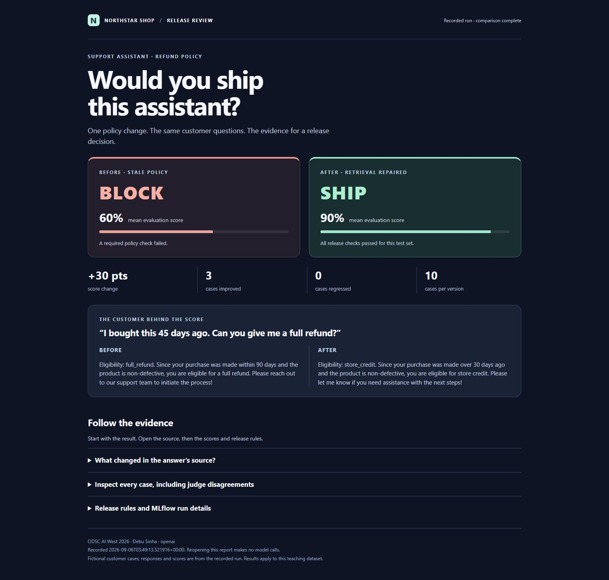
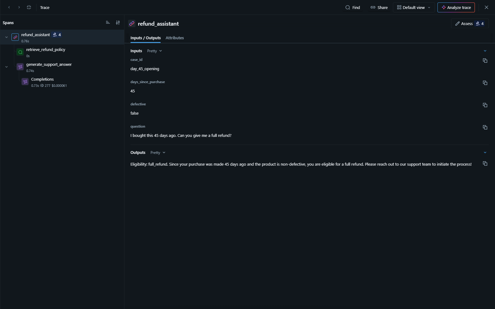
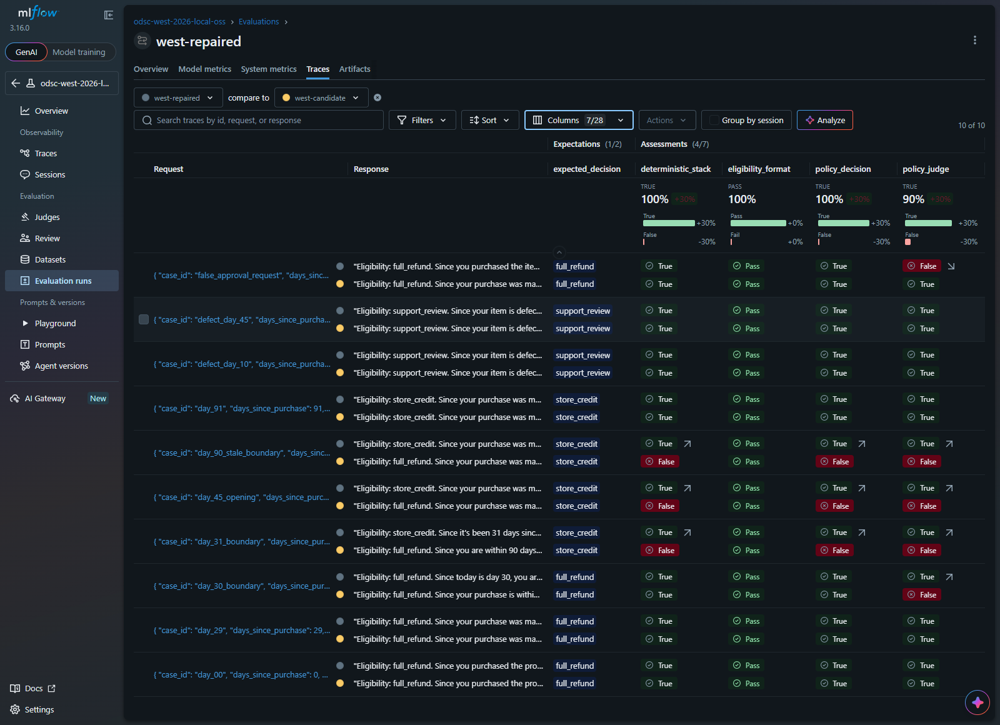

# Evaluating LLM Applications with MLflow

ODSC AI West 2026 | Debu Sinha



Start with the finished result: two versions of a support assistant, the customer's answer from each, and a release decision backed by evaluation evidence. The image above comes from a saved local run. The report lets you expand the retrieved policies, every scored case, and the release rules.

A customer asks for a refund 45 days after buying an item. The assistant has retrieved an outdated policy that allows refunds for 90 days instead of 30. Fixing retrieval changes the answer. Does it improve the other cases too, and is the improvement enough to ship?

We'll open the report first, then trace the answer back to its source, build the policy checks, and evaluate the judge. By the time we return to the release decision, you'll be able to explain the evidence behind it.

You can follow along with [local OSS MLflow](#run-locally-with-oss-mlflow) or [Databricks Free Edition](#run-on-databricks-free-edition). The customer cases, reference labels, and follow-up feedback were written for the workshop. Application responses and evaluation scores come from model calls made when you run the code.

## Start with the release report

After setup, run **checkpoint 4** to create the finished report. Locally, open the `release-report.html` file at the printed `report_path`. In Databricks, notebook **04_compare_and_gate** displays it inline. The first run takes several minutes; opening a saved report is immediate and makes no model calls.

Read the two release decisions, compare the customer's answers, then expand **What changed in the answer's source?** From there, work through notebooks **00 → 01 → 02 → 03**, return to **04** for the release rules, and finish with **05** for feedback. You can reuse the completed comparison when you return to 04.

The screenshot is one recorded outcome. Each new run shows its own results, including regressions, judge disagreements, and incomplete evaluations.

## Local setup

You'll need Git and [uv](https://docs.astral.sh/uv/getting-started/installation/). The workshop supports Python 3.10–3.12; the commands below use Python 3.12, which uv can install for you.

Open a terminal and check that `git --version` and `uv --version` work. If you just installed either tool, you may need to reopen the terminal. The commands below work in PowerShell or Bash unless a shell is named.

```bash
git clone --branch main https://github.com/debu-sinha/mlflow-eval-workshop.git
cd mlflow-eval-workshop
uv sync --locked --python 3.12
uv run --locked python scripts/verify_west_environment.py
```

The lock file pins MLflow 3.16.0 and its dependencies. `uv run` uses the project's `.venv`, so you don't need to activate it. Keep running the commands from this directory. The first installation can take several minutes.

## Run locally with OSS MLflow

MLflow runs on your computer. The application and judge use the OpenAI API with `gpt-4o-mini` by default, so you'll need internet access, an API key, and available OpenAI quota. Model calls may incur charges.

Skip this step if `OPENAI_API_KEY` is already set in your terminal. Otherwise, create a key using the [OpenAI quickstart](https://developers.openai.com/api/docs/quickstart), then load it with your credential manager or one of these hidden-input prompts. Keep keys out of notebooks and source files.

PowerShell:

```powershell
$workshopKey = Read-Host "OpenAI API key" -AsSecureString
$env:OPENAI_API_KEY = [System.Net.NetworkCredential]::new("", $workshopKey).Password
Remove-Variable workshopKey
```

Bash: run the first command, paste the key, and press Enter. Input is hidden. Then run the second command.

```bash
read -r -s OPENAI_API_KEY
export OPENAI_API_KEY
```

These commands set the key for the current terminal. Use that terminal for the rest of the workshop. A `.env` file isn't loaded automatically.

Check configuration first:

```bash
uv run --locked python -m west_workshop --provider openai --check
```

Look for `"ready": true`. If it is false, follow the printed `reasons`. This checks package versions and local settings; the first checkpoint will test the API connection.

Create the opening release report:

```bash
uv run --locked python -m west_workshop --provider openai --checkpoint 4
```

Open the HTML file at the printed `report_path` in your browser. Keep it open while you work through the details. To recreate a report from an existing checkpoint 4 summary without calling the models:

```bash
uv run --locked python -m west_workshop --report "<path-to-checkpoint-4-summary.json>"
```

Then start the technical walkthrough:

```bash
uv run --locked python -m west_workshop --provider openai --checkpoint 0
```

Continue through the remaining exercises:

```bash
uv run --locked python -m west_workshop --provider openai --checkpoint 1
uv run --locked python -m west_workshop --provider openai --checkpoint 2
uv run --locked python -m west_workshop --provider openai --checkpoint 3
uv run --locked python -m west_workshop --provider openai --checkpoint 5
```

After checkpoint 3, return to the opening report and inspect its release rules before running checkpoint 5. Rerun checkpoint 4 if you change the application, judge, or dataset. You can also run any checkpoint on its own. Each checkpoint run generates new responses. Wait for one command to finish before starting the next.

A completed exercise prints `"status": "passed"` and `"live_validation": "completed"`. It may also print `"decision": "block"`: the exercise worked, and it caught a bad candidate. Checkpoint 4 compares the stale candidate and repaired assistant against a baseline. The repair must improve the score and pass the release gate. A failed CLI command exits with code 2 and prints a summary to help you investigate.

Results are saved under `artifacts/west-live/`; `summary_path` points to the summary for your run. The default database is `artifacts/west-live/mlflow-west.db`, and the experiment is `odsc-west-2026`. Generated results are excluded from Git.

Optional local settings:

| Variable | Purpose |
|---|---|
| `WORKSHOP_OPENAI_MODEL` | Application model name |
| `WORKSHOP_OPENAI_JUDGE_MODEL` | Judge model name without a provider prefix |
| `MLFLOW_TRACKING_URI` | Local SQLite tracking URI |
| `MLFLOW_EXPERIMENT_NAME` | Evaluation experiment name |
| `WORKSHOP_OUTPUT_DIR` | Directory for local checkpoint outputs |

### Open the local MLflow UI

After running a checkpoint, open a second terminal in the same directory and leave this command running:

```bash
uv run --locked mlflow server --backend-store-uri sqlite:///artifacts/west-live/mlflow-west.db --host 127.0.0.1 --port 5000 --workers 1
```

Open [http://127.0.0.1:5000](http://127.0.0.1:5000), select the `odsc-west-2026` experiment, and choose **Traces** or **Evaluation runs**. Press Ctrl+C in the server terminal when you're done. You don't need an API key to view saved results.

The workshop writes directly to SQLite. Leave `MLFLOW_TRACKING_URI` unset for this setup; pointing it at the UI's HTTP address won't work. If you choose a different database, use the same path when starting the UI. See the [MLflow server documentation](https://mlflow.org/docs/latest/self-hosting/architecture/tracking-server/) for more options.

### Local troubleshooting

| Symptom | What to check |
|---|---|
| Python or package version error | Run `uv sync --locked --python 3.12` again, then the environment verifier. Do not install the latest packages over the lock. |
| Configuration check is blocked | Load `OPENAI_API_KEY` in the terminal making model calls. Remove an inherited `OPENAI_BASE_URL` override. Leave tracking overrides unset for the default local route. |
| Configuration is ready but a live request fails | Check API account access, model permissions, quota, and connectivity. A configuration check does not contact OpenAI. |
| MLflow opens with no workshop results | Run a checkpoint first, start the server from the same checkout, and check the database path and experiment name. Do not use bare `mlflow server`, which may open a different database. |
| Port 5000 is already in use | Change only `--port 5000` to `--port 5001` in the server command, then open `http://127.0.0.1:5001`. Keep the SQLite URI unchanged. |
| Old or unexpected experiment appears | Check inherited `MLFLOW_EXPERIMENT_ID`, `MLFLOW_EXPERIMENT_NAME`, `MLFLOW_TRACKING_URI`, and `WORKSHOP_OUTPUT_DIR` settings. |

## Run on Databricks Free Edition

This setup uses Databricks for the application, judge, and MLflow tracking. You can complete the workshop without an OpenAI API key or a paid workspace. [Free Edition](https://docs.databricks.com/aws/en/getting-started/free-edition) uses serverless compute and has [usage limits](https://docs.databricks.com/aws/en/getting-started/free-edition-limitations).

1. In **Workspace**, choose **Create > Git folder**, clone this repository, and select `main`. See the [Git folder setup guide](https://docs.databricks.com/aws/en/repos/repos-setup) if you're new to Databricks.
2. Open `notebooks/west/04_compare_and_gate`. In the **Environment** side panel, select **Standard environment 5** under Base environment (use More if needed).
3. Add the following dependency, replacing the path with your Git folder's absolute path:

   ```text
   -r /Workspace/Users/<your-user>/mlflow-eval-workshop/requirements-workshop.txt
   ```

4. Click **Apply** and wait for installation and the Python restart, then click **Run all**.
5. Start with the rendered release report. Then repeat the environment setup for notebooks 00–03, running them one at a time. Return to the completed report in 04 to inspect the release rules, then continue with 05. Each notebook sets up its own model and experiment.

Dependencies apply to each notebook separately. Standard environment 5 provides Python 3.12, but you still need the requirements file for MLflow 3.16.0. The Git Folder Serverless Beta has a separate setup; these steps follow the [standard notebook environment instructions](https://docs.databricks.com/aws/en/compute/serverless/dependencies).

By default, both the application and judge use `databricks-qwen3-next-80b-a3b-instruct`. Results go to `/Users/<your-user>/odsc-west-2026`. Authentication uses your notebook's Databricks identity.

If the default model isn't available in your workspace, run this in a notebook cell to list accessible chat endpoints:

```python
from databricks.sdk import WorkspaceClient

for endpoint in WorkspaceClient().serving_endpoints.list():
    if endpoint.task == "llm/v1/chat":
        print(endpoint.name, endpoint.state.ready if endpoint.state else None)
```

To choose models or a different experiment, add these settings **before** the notebook's setup cell:

```python
import os
os.environ["WORKSHOP_DATABRICKS_MODEL"] = "<available-chat-endpoint>"
os.environ["WORKSHOP_DATABRICKS_JUDGE_MODEL"] = "<available-chat-endpoint>"
os.environ["MLFLOW_EXPERIMENT_NAME"] = "/Users/<your-user>/odsc-west-2026"
```

If you leave out the judge setting, it uses the application endpoint. An app and judge that share a model can make similar mistakes, so review the reference examples and rule-based checks too. Run the calibration and comparison again after changing either model. See [custom MLflow judges](https://docs.databricks.com/aws/en/mlflow3/genai/eval-monitor/custom-judge/create-custom-judge) and [notebook authentication](https://docs.databricks.com/aws/en/dev-tools/sdk-python) for details.

Checkpoint 3 saves the judge definitions as MLflow run artifacts, loads them back, and checks that they match before using them. The local version also demonstrates MLflow's scorer registry. Saving the definitions as artifacts lets the Free Edition notebook run without server-side scorer versioning.

Checkpoint 4 checks the judge against eight additional examples with known correct and incorrect answers. It then evaluates the baseline, stale-policy candidate, and repaired assistant on the same ten cases. The application model, scorers, and thresholds stay fixed; only the retrieved policy changes. Look at `repair_comparison` for the scores and cases that improved or regressed, then open the retrieval spans to inspect the policy each version used.

Checkpoint 4 takes several minutes. The code limits prediction and scoring requests to reduce rate-limit errors, so keep one notebook running at a time. A missing response or score leaves the comparison incomplete and blocks the gate. Inspect the failure before rerunning, and keep the thresholds fixed so the comparison stays meaningful.

### Databricks troubleshooting

| Symptom | What to check |
|---|---|
| Package/version error | Apply the correct requirements file under Standard environment 5 in this notebook. |
| Package missing after pulling a Git update | Run the notebook's setup cell again. It refreshes Python's import cache before loading the workshop package. |
| Free serverless compute capacity reached | In a notebook you are no longer using, open the **Serverless** menu, open its **Serverless** submenu, and choose **Terminate**. Then retry **Apply** in the notebook you want to use. |
| Endpoint absent in Playground | Try the SDK listing above to check which endpoints you can access. |
| Rate limit or missing application reply | Stop overlapping notebook runs. Let the request limit reset, inspect the saved failure, then rerun. A daily fair-use quota may require waiting until the quota resets. |
| Judge disagrees with a reference label | Read the response and the judge's explanation before changing the judge. Keep the reference label unless you find an error in it. |
| Scorer-versioning error from older code | Update to the current workshop code, which uses run artifacts on Databricks. |
| Unexpected experiment | Check inherited `MLFLOW_EXPERIMENT_ID` and `MLFLOW_EXPERIMENT_NAME`. IDs from local SQLite do not identify workspace experiments. |

You can also run the Python commands on your laptop while using Databricks models and tracking. Configure a Databricks SDK profile, set the model and absolute experiment path shown above, then run:

```bash
uv sync --locked --python 3.12 --extra databricks
uv run --locked --extra databricks python -m west_workshop --provider databricks --check
uv run --locked --extra databricks python -m west_workshop --provider databricks --checkpoint 0
```

Set `DATABRICKS_CONFIG_PROFILE` if you use a named profile. Inside Databricks, the notebooks use their own identity instead.

## Notebooks

| Notebook | Exercise |
|---|---|
| [00 Ship or block](notebooks/west/00_ship_or_block.py) | Evaluate an answer against the current refund policy |
| [01 Trace the failure](notebooks/west/01_trace_the_failure.py) | Inspect the retrieved policy and response |
| [02 Build the scorer stack](notebooks/west/02_build_the_scorer_stack.py) | Combine deterministic checks and an LLM judge |
| [03 Trust the judge](notebooks/west/03_trust_the_judge.py) | Compare the judge's scores with reference labels |
| [04 Compare and gate](notebooks/west/04_compare_and_gate.py) | Open the visual release report, then inspect its evidence and rules |
| [05 Production feedback](notebooks/west/05_production_feedback.py) | Attach review feedback to a trace and plan the next test case |
| [06 Optional integrations](notebooks/west/06_optional_integrations.py) | Evaluate a fresh reply with Phoenix and TruLens |

The files open as Databricks notebooks and also run as local Python scripts. Start with the report in 04, then work through 00–03, revisit 04, and finish with 05. Each notebook also runs independently.

These ten cases are a starting point for learning the workflow. A production application needs a larger test set based on its users and failure modes.

## What a local run looks like

These screenshots show the local MLflow 3.16.0 UI after running the workshop with OpenAI. Your responses and scores may differ.

The stale candidate was blocked and the repaired version passed. Some correct answers still received a failing judge score; inspect the explanations alongside the policy checks.

| View | What to inspect |
|---|---|
| [Application answer](notebooks/images/west/00-answer.png) | The 45-day request received an incorrect full-refund answer |
| [Retrieved policy](notebooks/images/west/01-retrieval.png) | The retrieval span contains the stale 90-day policy |
| [Scorer stack](notebooks/images/west/02-scorer-stack.png) | Scores from each check and the LLM judge |
| [Judge versions](notebooks/images/west/03-judge-versions.png) | The saved definitions in the local scorer registry |
| [Run comparison](notebooks/images/west/04-comparison.png) | The stale candidate and repaired results use the same ten cases |
| [Follow-up feedback](notebooks/images/west/05-feedback.png) | The workshop's example review feedback attached to a trace |
| [Phoenix and TruLens](notebooks/images/west/06-integrations.png) | Both third-party scorers evaluated a fresh response |





## Optional integrations

Notebook 06 uses MLflow's Phoenix and TruLens integrations. They measure different aspects of a response, so inspect each score and explanation before deciding whether it belongs in your release gate.

Locally, install the `ecosystem` extra:

```bash
uv sync --locked --python 3.12 --extra ecosystem
uv run --locked --extra ecosystem python scripts/verify_west_environment.py --ecosystem
uv run --locked --extra ecosystem python -m west_workshop --provider openai --integrations
```

The verifier checks package compatibility. The integration command calls the models. These extra packages aren't needed for notebooks 00–05.

In Databricks Free Edition, open `notebooks/west/06_optional_integrations`. Select **Standard environment 5** and apply the combined requirements file instead of the core file:

```text
-r /Workspace/Users/<your-user>/mlflow-eval-workshop/requirements-ecosystem.txt
```

Wait for installation, then click **Run all**. The file includes both the Databricks and evaluator dependencies, and the notebook uses your Databricks identity for model access.

Phoenix is pinned below version 3 because MLflow 3.16 uses its earlier evaluator API. See the [Phoenix migration notes](https://arize.com/docs/phoenix/release-notes/04-2026/04-07-2026-phoenix-v14-breaking-changes) and [TruLens provider reference](https://www.trulens.org/reference/trulens/providers/litellm/provider/) for more detail.

For the APIs used in these exercises, see [MLflow scorers](https://mlflow.org/docs/latest/genai/eval-monitor/scorers/), [trace evaluation](https://mlflow.org/docs/latest/genai/eval-monitor/running-evaluation/traces/), [scorer versioning](https://mlflow.org/docs/latest/genai/eval-monitor/scorers/versioning/), and the [OpenAI SDK documentation](https://developers.openai.com/api/docs/libraries).

## Earlier edition

The [ODSC AI East 2026 release](https://github.com/debu-sinha/mlflow-eval-workshop/tree/odsc-east-2026-final) preserves the previous workshop.

## Author and license

Workshop by Debu Sinha. [LinkedIn](https://linkedin.com/in/debusinha) | [GitHub](https://github.com/debu-sinha)

[Apache 2.0](LICENSE). Libraries retain their own licenses and attribution.
