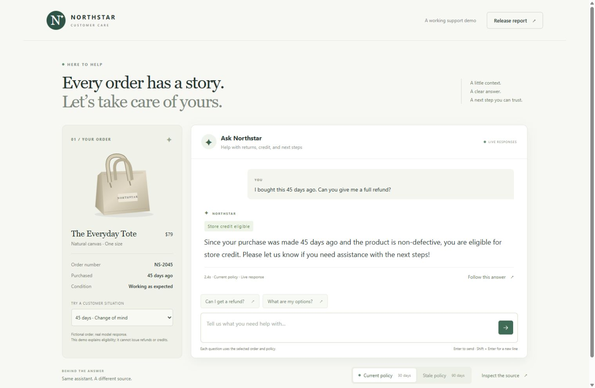

# Evaluating LLM Applications with MLflow

ODSC AI West 2026 | Debu Sinha



Start with a working support assistant. Choose a customer's order, ask about a refund, and follow the answer into its MLflow trace. Then compare the current and stale policies and open the release report to see whether the repair holds across the test cases. The image above shows an actual local app response.

A customer asks for a refund 45 days after buying an item. The assistant has retrieved an outdated policy that allows refunds for 90 days instead of 30. Fixing retrieval changes the answer. Does it improve the other cases too, and is the improvement enough to ship?

We'll use the app first, then trace an answer back to its source, write a scorer, evaluate a new case, and review the judge. By the time we return to the release decision, you'll be able to explain the evidence behind it and adapt the evaluation call to your own application.

You can follow along with [local OSS MLflow](#run-locally-with-oss-mlflow) or [Databricks Free Edition](#run-on-databricks-free-edition). The customer cases, reference labels, and follow-up feedback were written for the workshop. Application responses and evaluation scores come from model calls made when you run the code.

## Your path through the session

Bring enough Python familiarity to edit a function and a dictionary. Choose one execution route; you do not need both.

| When | What you do |
|---|---|
| Before the session | Complete [local setup](#local-setup) or [Free Edition setup](#run-on-databricks-free-edition). Run checkpoint 4 once and retain its report. On Databricks, also apply the core environment to notebook 02 for the hands-on exercise. |
| Opening demonstration | Watch the live support app, follow its trace, then inspect the recorded release report. You can deploy your own app afterward; deployment is not required for the notebook exercises. |
| Technical walkthrough | Follow 00 and 01, then use notebook 02 to repair a scorer and evaluate a new case. Review the judge in 03 and return to the completed 04 report to explain the release decision. |
| After the session | Complete 05, try the optional integrations in 06, and use the [adaptation guide](#adapt-this-evaluation-to-your-app) with your own app. |

Long evaluations can run during preparation. During the session, the presenter uses their saved outputs and makes short live calls; you run the notebook 02 exercise. Keep one model-calling notebook active at a time. If setup is incomplete, follow the displayed evidence and complete the runnable exercise afterward.

For the short exercise in Databricks, run notebook 02's setup cell and jump to **Your turn**. The lab sets up its own tracking, so it does not require the earlier ten-case evaluation to run first.

The CLI checkpoint commands run the prepared evaluations. To do the editable lab locally, open `notebooks/west/02_build_the_scorer_stack.py` in your editor and run it with `uv run --locked python notebooks/west/02_build_the_scorer_stack.py`. On Databricks, edit and run its cells directly. The starter scorer intentionally disagrees with two authored format examples; fixing it is the exercise. **Run all** still completes with the starter.

## Start with the support app

The app calls `make_predictor` in `west_workshop/runtime.py`, the same function evaluated in the notebooks. It shows fictional orders and makes a real model call for every question. The source selector chooses one policy document; it is a small retrieval example, not a vector database. Each question is independent and includes the selected order's age and condition.

After completing either setup below:

1. Open the app and keep **Current policy** selected. Choose the **45 days** order, click **Can I get a refund?**, then send the question.
2. Read the actual answer. Click **Follow this answer** to see its saved retrieval span and open the trace in MLflow.
3. Select **Stale policy** and send the same question again. Compare the eligibility and explanation. Switching policies clears the previous answer so it cannot be mistaken for a new response.
4. Open **Release report** to inspect the recorded comparison across ten cases. A new chat reply has not been scored by that report.

The app explains refund eligibility and next steps. It cannot approve a payment, issue credit, or create a support ticket. A defective-item request should lead to guidance for human review.

Refund eligibility could be ordinary business logic. This small app teaches how to evaluate generated advice: whether it follows the current policy, explains the decision correctly, and avoids unsupported action claims. A production system can calculate eligibility deterministically and ask the assistant to explain it. The [adaptation guide](#why-use-an-llm-for-a-refund-rule) describes that boundary.

### Run the app locally

Complete [local OSS setup](#run-locally-with-oss-mlflow), then run this from the same terminal where you loaded your API key:

```bash
uv run --locked python app.py
```

Open [http://127.0.0.1:8000](http://127.0.0.1:8000). The app uses the same local MLflow database and model configuration as the checkpoints. In the evidence panel, copy the trace ID and find it in the local MLflow UI. Stop the app with Ctrl+C.

### Deploy the app on Databricks Free Edition

This is an optional deployment exercise. The presenter shows a hosted app during the opening; participants can complete all notebook exercises without deploying one.

Complete [Databricks notebook setup](#run-on-databricks-free-edition) and run checkpoint 4 first. Add a cell to prepare the app's storage:

```python
from west_workshop.prepare_databricks_app import prepare
app_storage = prepare()
print(app_storage)
```

This creates a `northstar_support` schema and `reports` volume in your `workspace` catalog, plus a separate `/Users/<your-user>/northstar-support` experiment. It reuses them on later calls. Traces and report artifacts use this volume; the notebook's experiment stays the same. If your writable catalog has another name, pass `prepare(catalog="your_catalog")`.

Then create a custom app from **App switcher > Databricks Apps > Create app**. Choose a name such as `northstar-support` and configure this public Git repository on branch `main`:

```text
https://github.com/debu-sinha/mlflow-eval-workshop.git
```

Deploy from the repository root, where `app.py`, `app.yaml`, and `requirements.txt` live. Add these app resources with the exact keys shown; `app.yaml` reads their values:

| Resource key | Resource | Permission |
|---|---|---|
| `serving-endpoint` | The same chat endpoint selected in your notebooks | Can query |
| `experiment` | The `experiment_name` printed by `prepare()` | Can edit |
| `report-storage` | The Unity Catalog volume printed as `volume` | Read and write (WRITE_VOLUME) |

The app uses its own Databricks identity. Add all three resources: notebook permissions do not transfer to the app. The volume resource grants storage access; its path is already recorded in the experiment, so it needs no environment variable. No personal API key belongs in the app configuration. See [model resources](https://docs.databricks.com/aws/en/dev-tools/databricks-apps/model-serving), [experiment resources](https://docs.databricks.com/aws/en/dev-tools/databricks-apps/mlflow), and [Git deployment](https://docs.databricks.com/aws/en/dev-tools/databricks-apps/deploy).

Use the volume-backed experiment for this Free Edition app. During testing, its default MLflow-managed storage endpoint was unreachable from Apps. Unity Catalog trace tables also rejected Free Edition's default storage. Ordinary MLflow trace artifacts in a [Unity Catalog volume](https://docs.databricks.com/aws/en/mlflow/experiments) use the supported Files API and keep the usual MLflow trace view.

After deployment, open the app URL and send a question. Each successful answer includes a saved trace, and **Follow this answer** links to that exact trace. The app handles one model request at a time to keep the demonstration within the shared endpoint's limits.

Free Edition supports up to three apps and stops an app after 24 hours; restart it before using it again. App users must belong to the same Databricks account. Workshop participants can deploy their own copy in their own Free Edition account. See [Free Edition limits](https://docs.databricks.com/aws/en/getting-started/free-edition-limitations) and [app access](https://docs.databricks.com/aws/en/dev-tools/databricks-apps/key-concepts).

### Publish the recorded release report to the app

This copies a saved checkpoint 4 summary into the app's MLflow experiment. It makes no new model calls and does not change scores or gate decisions.

Locally:

```bash
uv run --locked python -m west_workshop.publish_report "<path-to-checkpoint-4-summary.json>" --provider openai
```

In Databricks, add a cell after checkpoint 4 has completed:

```python
from west_workshop.publish_report import publish
publish(summary["summary_path"], provider="databricks",
        experiment_id=app_storage["experiment_id"])
```

Publish to the experiment you attached to the app. **Release report** opens the most recently published comparison, including an incomplete or blocked result. It does not search for a winning run. Publish again after rerunning checkpoint 4 if you want the app to show the new evidence.

### App troubleshooting

| Symptom | What to check |
|---|---|
| Deployment cannot find a resource | Use the exact resource keys `serving-endpoint` and `experiment`, and attach the `report-storage` volume. |
| The page loads but a question fails | Check model Can query, experiment Can edit, and volume read/write for the app identity, then endpoint availability and remaining quota. Use the experiment created by `prepare()`. |
| Another question is being answered | Wait for that request to finish, then retry. No answer is queued or substituted. |
| A request times out | The page stops waiting after three minutes. The original call may still be finishing; if the app stays busy, restart it and check its resources. |
| Release report is unavailable | Publish a checkpoint 4 summary into the experiment attached to this app. |
| The app has stopped | Restart it from Databricks Apps. Free Edition automatically stops apps after 24 hours. |

## Create the release report


After setup, run **checkpoint 4** to create the finished report. Locally, open the `release-report.html` file at the printed `report_path`. In Databricks, notebook **04_compare_and_gate** displays it inline. The first run takes several minutes; opening a saved report is immediate and makes no model calls.

Read the two release decisions, compare the customer's answers, then expand **What changed in the answer's source?** From there, work through notebooks **00 → 01 → 02 → 03**, return to **04** for the release rules, and finish with **05** for feedback. You can reuse the completed comparison when you return to 04.

The screenshot is one recorded outcome. Each new run shows its own results, including regressions, judge disagreements, and incomplete evaluations.

## Local setup

You'll need Git and [uv](https://docs.astral.sh/uv/getting-started/installation/). The workshop supports Python 3.10–3.12; the commands below use Python 3.12, which uv can install for you.

Open a terminal and check that `git --version` and `uv --version` work. If you just installed either tool, you may need to reopen the terminal. The commands below work in PowerShell or Bash unless a shell is named.

```bash
git clone --branch main https://github.com/debu-sinha/mlflow-eval-workshop.git
cd mlflow-eval-workshop
uv sync --locked --python 3.12
uv run --locked python scripts/verify_west_environment.py
```

The lock file pins MLflow 3.16.0 and its dependencies. `uv run` uses the project's `.venv`, so you don't need to activate it. Keep running the commands from this directory. The first installation can take several minutes.

## Run locally with OSS MLflow

MLflow runs on your computer. The application and judge use the OpenAI API with `gpt-4o-mini` by default, so you'll need internet access, an API key, and available OpenAI quota. Model calls may incur charges.

Skip this step if `OPENAI_API_KEY` is already set in your terminal. Otherwise, create a key using the [OpenAI quickstart](https://developers.openai.com/api/docs/quickstart), then load it with your credential manager or one of these hidden-input prompts. Keep keys out of notebooks and source files.

PowerShell:

```powershell
$workshopKey = Read-Host "OpenAI API key" -AsSecureString
$env:OPENAI_API_KEY = [System.Net.NetworkCredential]::new("", $workshopKey).Password
Remove-Variable workshopKey
```

Bash: run the first command, paste the key, and press Enter. Input is hidden. Then run the second command.

```bash
read -r -s OPENAI_API_KEY
export OPENAI_API_KEY
```

These commands set the key for the current terminal. Use that terminal for the rest of the workshop. A `.env` file isn't loaded automatically.

Check configuration first:

```bash
uv run --locked python -m west_workshop --provider openai --check
```

Look for `"ready": true`. If it is false, follow the printed `reasons`. This checks package versions and local settings; the first checkpoint will test the API connection.

During preparation, create the release report that follows the live app demonstration:

```bash
uv run --locked python -m west_workshop --provider openai --checkpoint 4
```

Open the HTML file at the printed `report_path` in your browser. Keep it open while you work through the details. To recreate a report from an existing checkpoint 4 summary without calling the models:

```bash
uv run --locked python -m west_workshop --report "<path-to-checkpoint-4-summary.json>"
```

Then start the technical walkthrough:

```bash
uv run --locked python -m west_workshop --provider openai --checkpoint 0
```

Continue through the remaining exercises:

```bash
uv run --locked python -m west_workshop --provider openai --checkpoint 1
uv run --locked python notebooks/west/02_build_the_scorer_stack.py
uv run --locked python -m west_workshop --provider openai --checkpoint 3
uv run --locked python -m west_workshop --provider openai --checkpoint 5
```

After checkpoint 3, return to the opening report and inspect its release rules before running checkpoint 5. Rerun checkpoint 4 if you change the application, judge, or dataset. You can also run any checkpoint on its own. Each checkpoint run generates new responses. Wait for one command to finish before starting the next.

A completed exercise prints `"status": "passed"` and `"live_validation": "completed"`. It may also print `"decision": "block"`: the exercise worked, and it caught a bad candidate. Checkpoint 4 compares the stale candidate and repaired assistant against a baseline. The repair must improve the score and pass the release gate. A failed CLI command exits with code 2 and prints a summary to help you investigate.

Results are saved under `artifacts/west-live/`; `summary_path` points to the summary for your run. The default database is `artifacts/west-live/mlflow-west.db`, and the experiment is `odsc-west-2026`. Generated results are excluded from Git.

Optional local settings:

| Variable | Purpose |
|---|---|
| `WORKSHOP_OPENAI_MODEL` | Application model name |
| `WORKSHOP_OPENAI_JUDGE_MODEL` | Judge model name without a provider prefix |
| `MLFLOW_TRACKING_URI` | Local SQLite tracking URI |
| `MLFLOW_EXPERIMENT_NAME` | Evaluation experiment name |
| `WORKSHOP_OUTPUT_DIR` | Directory for local checkpoint outputs |

### Open the local MLflow UI

After running a checkpoint, open a second terminal in the same directory and leave this command running:

```bash
uv run --locked mlflow server --backend-store-uri sqlite:///artifacts/west-live/mlflow-west.db --host 127.0.0.1 --port 5000 --workers 1
```

Open [http://127.0.0.1:5000](http://127.0.0.1:5000), select the `odsc-west-2026` experiment, and choose **Traces** or **Evaluation runs**. Press Ctrl+C in the server terminal when you're done. You don't need an API key to view saved results.

The workshop writes directly to SQLite. Leave `MLFLOW_TRACKING_URI` unset for this setup; pointing it at the UI's HTTP address won't work. If you choose a different database, use the same path when starting the UI. See the [MLflow server documentation](https://mlflow.org/docs/latest/self-hosting/architecture/tracking-server/) for more options.

### Local troubleshooting

| Symptom | What to check |
|---|---|
| Python or package version error | Run `uv sync --locked --python 3.12` again, then the environment verifier. Do not install the latest packages over the lock. |
| Configuration check is blocked | Load `OPENAI_API_KEY` in the terminal making model calls. Remove an inherited `OPENAI_BASE_URL` override. Leave tracking overrides unset for the default local route. |
| Configuration is ready but a live request fails | Check API account access, model permissions, quota, and connectivity. A configuration check does not contact OpenAI. |
| MLflow opens with no workshop results | Run a checkpoint first, start the server from the same checkout, and check the database path and experiment name. Do not use bare `mlflow server`, which may open a different database. |
| Port 5000 is already in use | Change only `--port 5000` to `--port 5001` in the server command, then open `http://127.0.0.1:5001`. Keep the SQLite URI unchanged. |
| Old or unexpected experiment appears | Check inherited `MLFLOW_EXPERIMENT_ID`, `MLFLOW_EXPERIMENT_NAME`, `MLFLOW_TRACKING_URI`, and `WORKSHOP_OUTPUT_DIR` settings. |

## Run on Databricks Free Edition

This setup uses Databricks for the application, judge, and MLflow tracking. You can complete the workshop without an OpenAI API key or a paid workspace. [Free Edition](https://docs.databricks.com/aws/en/getting-started/free-edition) uses serverless compute and has [usage limits](https://docs.databricks.com/aws/en/getting-started/free-edition-limitations).

1. In **Workspace**, choose **Create > Git folder**, clone this repository, and select `main`. See the [Git folder setup guide](https://docs.databricks.com/aws/en/repos/repos-setup) if you're new to Databricks.
2. Open `notebooks/west/04_compare_and_gate`. In the **Environment** side panel, select **Standard environment 5** under Base environment (use More if needed).
3. Add the following dependency, replacing the path with your Git folder's absolute path:

   ```text
   -r /Workspace/Users/<your-user>/mlflow-eval-workshop/requirements-workshop.txt
   ```

4. Click **Apply** and wait for installation and the Python restart, then click **Run all**.
5. Start with the rendered release report. Then repeat the environment setup for notebooks 00–03, running them one at a time. Return to the completed report in 04 to inspect the release rules, then continue with 05. Each notebook sets up its own model and experiment.

Dependencies apply to each notebook separately. Standard environment 5 provides Python 3.12, but you still need the requirements file for MLflow 3.16.0. The Git Folder Serverless Beta has a separate setup; these steps follow the [standard notebook environment instructions](https://docs.databricks.com/aws/en/compute/serverless/dependencies).

By default, both the application and judge use `databricks-qwen3-next-80b-a3b-instruct`. Results go to `/Users/<your-user>/odsc-west-2026`. Authentication uses your notebook's Databricks identity.

If the default model isn't available in your workspace, run this in a notebook cell to list accessible chat endpoints:

```python
from databricks.sdk import WorkspaceClient

for endpoint in WorkspaceClient().serving_endpoints.list():
    if endpoint.task == "llm/v1/chat":
        print(endpoint.name, endpoint.state.ready if endpoint.state else None)
```

To choose models or a different experiment, add these settings **before** the notebook's setup cell:

```python
import os
os.environ["WORKSHOP_DATABRICKS_MODEL"] = "<available-chat-endpoint>"
os.environ["WORKSHOP_DATABRICKS_JUDGE_MODEL"] = "<available-chat-endpoint>"
os.environ["MLFLOW_EXPERIMENT_NAME"] = "/Users/<your-user>/odsc-west-2026"
```

If you leave out the judge setting, it uses the application endpoint. An app and judge that share a model can make similar mistakes, so review the reference examples and rule-based checks too. Run the calibration and comparison again after changing either model. See [custom MLflow judges](https://docs.databricks.com/aws/en/mlflow3/genai/eval-monitor/custom-judge/create-custom-judge) and [notebook authentication](https://docs.databricks.com/aws/en/dev-tools/sdk-python) for details.

Checkpoint 3 saves the judge definitions as MLflow run artifacts, loads them back, and checks that they match before using them. The local version also demonstrates MLflow's scorer registry. Saving the definitions as artifacts lets the Free Edition notebook run without server-side scorer versioning.

Checkpoint 4 checks the judge against eight additional examples with known correct and incorrect answers. It then evaluates the baseline, stale-policy candidate, and repaired assistant on the same ten cases. The application model, scorers, and thresholds stay fixed; only the retrieved policy changes. Look at `repair_comparison` for the scores and cases that improved or regressed, then open the retrieval spans to inspect the policy each version used.

Read the report's eligibility counts separately from its combined score. In one recorded Free Edition run, eligibility improved from 7/10 to 10/10 while combined checks improved from 2/10 to 10/10. The report also surfaces correct labels whose replies the judge rejected. [Two recorded cases](#read-the-answer-behind-the-score) show a wrong policy explanation and an apparent judge mistake; neither is hidden by the final average.

Checkpoint 4 takes several minutes. The code limits prediction and scoring requests to reduce rate-limit errors, so keep one notebook running at a time. A missing response or score leaves the comparison incomplete and blocks the gate. Inspect the failure before rerunning, and keep the thresholds fixed so the comparison stays meaningful.

### Databricks troubleshooting

| Symptom | What to check |
|---|---|
| Package/version error | Apply the correct requirements file under Standard environment 5 in this notebook. |
| Package missing after pulling a Git update | Run the notebook's setup cell again. It refreshes Python's import cache before loading the workshop package. |
| Free serverless compute capacity reached | In a notebook you are no longer using, open the **Serverless** menu, open its **Serverless** submenu, and choose **Terminate**. Then retry **Apply** in the notebook you want to use. |
| Endpoint absent in Playground | Try the SDK listing above to check which endpoints you can access. |
| Rate limit or missing application reply | Stop overlapping notebook runs. Let the request limit reset, inspect the saved failure, then rerun. A daily fair-use quota may require waiting until the quota resets. |
| Judge disagrees with a reference label | Read the response and the judge's explanation before changing the judge. Keep the reference label unless you find an error in it. |
| MLflow warns that `extraContext` is not whitelisted | This concerns optional notebook metadata. The lab filters this specific warning; other warnings and evaluation errors remain visible. Inspect the actual scores and saved traces to assess completion. |
| Scorer-versioning error from older code | Update to the current workshop code, which uses run artifacts on Databricks. |
| Unexpected experiment | Check inherited `MLFLOW_EXPERIMENT_ID` and `MLFLOW_EXPERIMENT_NAME`. IDs from local SQLite do not identify workspace experiments. |

You can also run the Python commands on your laptop while using Databricks models and tracking. Configure a Databricks SDK profile, set the model and absolute experiment path shown above, then run:

```bash
uv sync --locked --python 3.12 --extra databricks
uv run --locked --extra databricks python -m west_workshop --provider databricks --check
uv run --locked --extra databricks python -m west_workshop --provider databricks --checkpoint 0
```

Set `DATABRICKS_CONFIG_PROFILE` if you use a named profile. Inside Databricks, the notebooks use their own identity instead.

## Notebooks

| Notebook | Exercise |
|---|---|
| [00 Ship or block](notebooks/west/00_ship_or_block.py) | Evaluate an answer against the current refund policy |
| [01 Trace the failure](notebooks/west/01_trace_the_failure.py) | Inspect the retrieved policy and response |
| [02 Build the scorer stack](notebooks/west/02_build_the_scorer_stack.py) | Write a scorer, test it, and run a new case with the MLflow evaluation API |
| [03 Trust the judge](notebooks/west/03_trust_the_judge.py) | Compare the judge's scores with reference labels |
| [04 Compare and gate](notebooks/west/04_compare_and_gate.py) | Open the visual release report, then inspect its evidence and rules |
| [05 Production feedback](notebooks/west/05_production_feedback.py) | Attach review feedback to a trace and plan the next test case |
| [06 Optional integrations](notebooks/west/06_optional_integrations.py) | Evaluate a fresh reply with Phoenix and TruLens |

The files open as Databricks notebooks and also run as local Python scripts. Prepare the report in 04 ahead of time. The presentation starts with the live app and report preview, then follows 00–03, revisits 04, and finishes with 05. Each notebook also runs independently.

These ten cases are a starting point for learning the workflow. A production application needs a larger test set based on its users and failure modes.

## Adapt this evaluation to your app

Start with the small evaluation you ran in [notebook 02](notebooks/west/02_build_the_scorer_stack.py). It has the three pieces you need: cases, a prediction function, and scorers. The prepared checkpoints add trace verification, version records, judge controls, and the release gate.

### Make one useful change in the lab

1. Repair `one_eligibility_line` and run its four authored examples. Explain the two invalid answers the starter accepted. These examples test your scorer, without calling a model.
2. Replace `new_case` with a request not already in the dataset. Give it a stable ID, write its expected decision from the policy, and state the behavior it tests. Keep one existing case for comparison.
3. Run the `mlflow.genai.evaluate(...)` cell once. Open `west-attendee-lab` in MLflow and inspect the response, both scores, and trace. Preserve a failure or missing score and investigate it.
4. Write two sentences: “This test checks ___. It does not establish ___.” For example, one valid eligibility line does not establish that the explanation cites the current policy.

The lab uses fresh responses from the current-policy assistant and Python scorers. It has no semantic judge and makes no release decision. Your edits do not enter checkpoint 4 automatically.

### Replace these pieces for your own app

| Piece | Workshop example | Your replacement |
|---|---|---|
| Prediction function | `make_predictor(provider, variant)` returns a traced function | A small function that calls your actual application and returns its answer. Match its named arguments to the keys in each row's `inputs`. |
| Cases | `lab_cases`, then the ten cases in `west_workshop/data.py` | Reviewed requests, stable IDs, and expected behavior from your domain. Put reference labels under `expectations`. Include known failures and cases you have not used to tune the application. |
| Python checks | `one_eligibility_line` and `policy_decision` | Properties you can check reliably, such as schema validity, allowed actions, or agreement with reviewed labels. Test each check on valid and invalid outputs. |
| Semantic judge | `_policy_judge` in `west_workshop/runtime.py` | A rubric for the meaning you need to assess, with valid and invalid controls and reviewed examples. Keep its model and definition with the run. |
| Release requirements | `_gate` in `west_workshop/runtime.py` | Your mandatory checks, quality floor, tolerated regressions, and completeness requirements, chosen before evaluating the change. |

`mlflow.genai.evaluate(data=cases, predict_fn=predict, scorers=checks)` is the evaluation call in both environments. `predict` is your real application adapter. A scorer can request `inputs`, `outputs`, `expectations`, or the `trace` as named arguments. See the [MLflow quickstart](https://mlflow.org/docs/latest/genai/eval-monitor/quickstart/) and [custom scorer documentation](https://mlflow.org/docs/latest/genai/eval-monitor/scorers/custom/).

For a multi-turn assistant, an isolated question is not enough: construct the conversation state your app actually receives and score the resulting behavior. If your app calls tools, inspect the requested action and actual tool result as well as its prose. The workshop assistant handles independent questions and performs no transactions.

### Why use an LLM for a refund rule?

The refund decision itself can be deterministic. A production design can calculate eligibility in business logic and give that result to the assistant to explain. The teaching app deliberately lets us see what happens when generated advice relies on a stale source. We evaluate whether the answer follows the current policy, explains it correctly, and avoids claiming an action it cannot perform.

If you move eligibility into a deterministic service, evaluate both parts: test the service's boundary conditions directly, then check that the assistant faithfully explains the returned decision. Keep authorization and transaction execution in the services that own them.

### Turn a lab finding into a release requirement

Save the original run. Review the new case and label, version the dataset or scorer change, and evaluate baseline, candidate, and repaired versions with the same updated measurement. Do not compare a new score with an old score produced by different cases or scorers.

For this repository, promote reviewed cases into `dataset()` and checks into `build_scorers()`, then run checkpoint 4. Review `_gate` explicitly when adding a mandatory check: a score being logged does not automatically make it a release requirement. Recalibrate after changing the judge. Keep the fixed thresholds while comparing versions, and retain incomplete runs.

Before a production release, collect a representative held-out set, review judge agreement with people, cover high-impact failure modes, and measure latency and cost. Run your fixed comparison in CI and save its evidence. The workshop CLI already returns a nonzero exit code when checkpoint 4 fails; adapting that command to your application still requires the domain-specific work above.

You have completed the exercise when you can point to your new case, scorer, actual result, and a limitation of that result. Matching the presenter's percentage is not a completion requirement.

## Read the answer behind the score

These observations come from one completed Databricks Free Edition checkpoint 4 run on September 6, 2026, using `databricks-qwen3-next-80b-a3b-instruct`. They are recorded examples. A new run must be read using its own responses, scores, and judge explanations.

| Version | Correct eligibility | Combined checks passed |
|---|---:|---:|
| Baseline, current policy | 10/10 | 9/10 |
| Candidate, stale policy | 7/10 | 2/10 |
| Repaired, current policy | 10/10 | 10/10 |

The combined score is the mean of each case's lower score from `deterministic_stack` and `policy_judge`. In this run, those scores were binary. The eight improved combined scores included three corrected eligibility decisions and five cases whose eligibility was already correct. This is why a change from 20% to 100% should not be described as eight corrected refund decisions.

### Correct decision, incorrect explanation

For the non-defective item at exactly 30 days, the stale candidate answered:

> Eligibility: full_refund
> You’re within the 90-day window for a full refund since your item isn’t defective. Next step: visit your order page to start the return request.

The eligibility label is correct at day 30. The explanation cites an incorrect 90-day window. The policy-label scorer and deterministic stack passed; the semantic judge rejected the answer because the policy window contradicted the current source.

The repaired assistant answered:

> Eligibility: full_refund
> You’re within the 30-day window, so you qualify for a full refund. Next step: start your return request in your account dashboard.

Its label stayed the same, its explanation used the current policy, and all required checks passed. This case shows the additional evidence a semantic check can provide.

### A judge rejection that deserves correction

The baseline answer for a non-defective item at 45 days was:

> Eligibility: store_credit
> Since it’s been 45 days since your purchase and the item isn’t defective, you’re eligible for store credit. Next step: visit your account to claim it.

All deterministic checks passed. The judge rejected “visit your account to claim it,” interpreting that customer instruction as an implied transaction by the assistant.

Read the [actual rubric](west_workshop/runtime.py) in `_policy_judge`: customer next steps are permitted; an explicit claim or promise that the assistant executes a transaction is rejected. The answer directs the customer to their own account. It does not say the assistant issued credit. This is an apparent false rejection by the judge. The separate positive control `review_customer_next_step` also permits the customer to request or claim credit.

The original score remains 0 in the report. Recognizing a judge mistake does not rewrite the recorded gate. Document the disagreement, clarify or change the judge if needed, rerun its controls and reviewed examples, and then compare every application version with that same judge. Eight passing controls did not establish reliability on every generated answer.

### Use your own run

Read **What actually improved?** in the report, then open **Review the judge**. The latter lists recorded cases with a correct eligibility label and a rejected reply, including baseline cases. It does not automatically classify them as judge errors: the two examples above show why a person must read the answer and rubric together.

For one case, state the expected behavior, the assistant's exact claim, the scorer that detected a problem, and whether you agree with its rationale. If no case matches that pattern in your run, keep that observation and use this explicitly recorded example for discussion.

## What a local run looks like

These screenshots show the local MLflow 3.16.0 UI after running the workshop with OpenAI. Your responses and scores may differ.

The stale candidate was blocked and the repaired version passed. Some correct answers still received a failing judge score; inspect the explanations alongside the policy checks.

| View | What to inspect |
|---|---|
| [Application answer](notebooks/images/west/00-answer.png) | The 45-day request received an incorrect full-refund answer |
| [Retrieved policy](notebooks/images/west/01-retrieval.png) | The retrieval span contains the stale 90-day policy |
| [Scorer stack](notebooks/images/west/02-scorer-stack.png) | Scores from each check and the LLM judge |
| [Judge versions](notebooks/images/west/03-judge-versions.png) | The saved definitions in the local scorer registry |
| [Run comparison](notebooks/images/west/04-comparison.png) | The stale candidate and repaired results use the same ten cases |
| [Follow-up feedback](notebooks/images/west/05-feedback.png) | The workshop's example review feedback attached to a trace |
| [Phoenix and TruLens](notebooks/images/west/06-integrations.png) | Both third-party scorers evaluated a fresh response |


## Optional integrations

Notebook 06 uses MLflow's Phoenix and TruLens integrations. They measure different aspects of a response, so inspect each score and explanation before deciding whether it belongs in your release gate.

Locally, install the `ecosystem` extra:

```bash
uv sync --locked --python 3.12 --extra ecosystem
uv run --locked --extra ecosystem python scripts/verify_west_environment.py --ecosystem
uv run --locked --extra ecosystem python -m west_workshop --provider openai --integrations
```

The verifier checks package compatibility. The integration command calls the models. These extra packages aren't needed for notebooks 00–05.

In Databricks Free Edition, open `notebooks/west/06_optional_integrations`. Select **Standard environment 5** and apply the combined requirements file instead of the core file:

```text
-r /Workspace/Users/<your-user>/mlflow-eval-workshop/requirements-ecosystem.txt
```

Wait for installation, then click **Run all**. The file includes both the Databricks and evaluator dependencies, and the notebook uses your Databricks identity for model access.

Phoenix is pinned below version 3 because MLflow 3.16 uses its earlier evaluator API. See the [Phoenix migration notes](https://arize.com/docs/phoenix/release-notes/04-2026/04-07-2026-phoenix-v14-breaking-changes) and [TruLens provider reference](https://www.trulens.org/reference/trulens/providers/litellm/provider/) for more detail.

For the APIs used in these exercises, see [MLflow scorers](https://mlflow.org/docs/latest/genai/eval-monitor/scorers/), [trace evaluation](https://mlflow.org/docs/latest/genai/eval-monitor/running-evaluation/traces/), [scorer versioning](https://mlflow.org/docs/latest/genai/eval-monitor/scorers/versioning/), and the [OpenAI SDK documentation](https://developers.openai.com/api/docs/libraries).

## Earlier edition

The [ODSC AI East 2026 release](https://github.com/debu-sinha/mlflow-eval-workshop/tree/odsc-east-2026-final) preserves the previous workshop.

## Author and license

Workshop by Debu Sinha. [LinkedIn](https://linkedin.com/in/debusinha) | [GitHub](https://github.com/debu-sinha)

[Apache 2.0](LICENSE). Libraries retain their own licenses and attribution.
