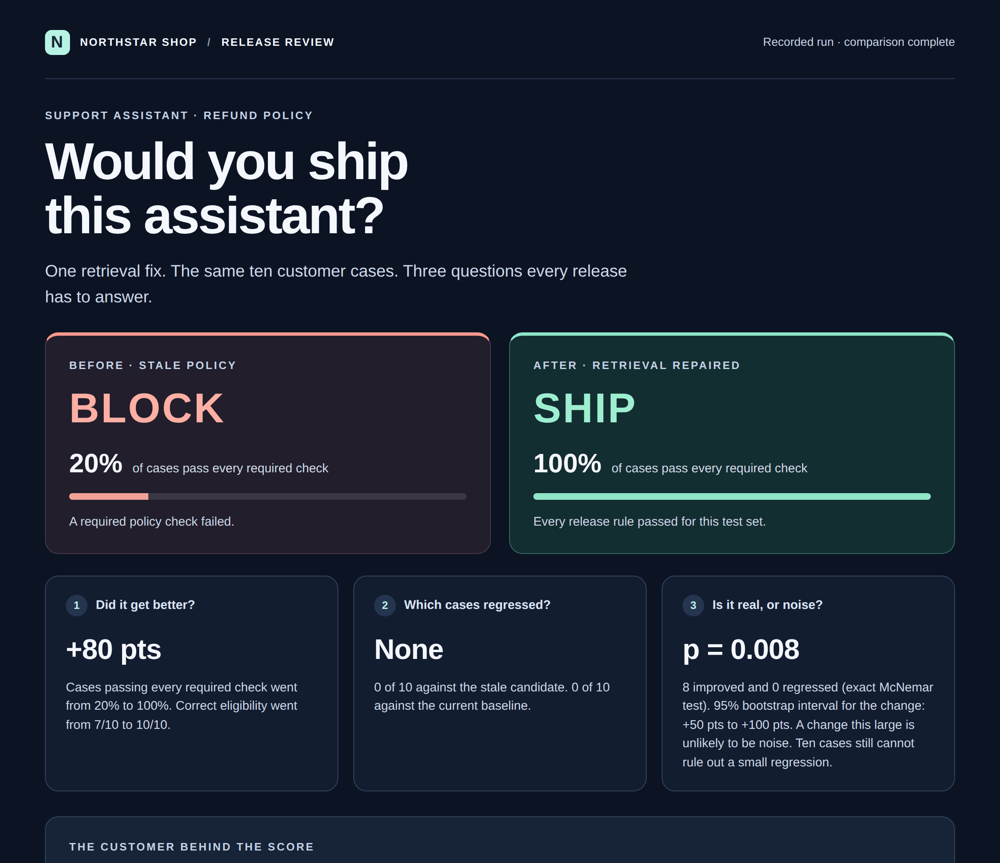

# Would you ship this assistant?

**Evaluating LLM Applications with MLflow** · ODSC AI West 2026 · Debu Sinha



A customer bought a tote 45 days ago and asks for a full refund. The support assistant says yes. The policy says store credit after 30 days. The answer is polite, fluent, and wrong.

This workshop follows that one answer from a live support app to a release decision you can defend. You will trace where the wrong answer began, write the checks that catch it, test the judge that grades it, and decide with evidence whether the fix is ready to ship. Every release decision has to answer three questions:

1. **Did it get better?**
2. **Which cases regressed?**
3. **Is it real, or noise?**

By the end of the session you can answer all three for this assistant, and you leave with the code to answer them for yours.

## The story in seven notebooks

Each notebook is one chapter of the same story, and each one also runs on its own.

| Chapter | Notebook | The question | MLflow you will use |
|---|---|---|---|
| Prologue | [00 Ship or block](notebooks/west/00_ship_or_block.py) | Would you ship this answer? | `mlflow.genai.evaluate` with one Python scorer |
| Trace | [01 Trace the failure](notebooks/west/01_trace_the_failure.py) | Where did the refund promise begin? | `@mlflow.trace`, spans, scoring a stored trace |
| Score | [02 Build the scorer stack](notebooks/west/02_build_the_scorer_stack.py) | Which checks should run on every answer? | `@scorer`, `RegexMatch`, `PIIDetection`, `ResponseLength`, `make_scorer_ensemble`, `make_judge` |
| Trust | [03 Trust the judge](notebooks/west/03_trust_the_judge.py) | What if the judge is wrong? | Judge calibration, `generate_rationale_first`, saved judge definitions |
| Decide | [04 Compare and gate](notebooks/west/04_compare_and_gate.py) | Better, regressed, or noise? | A paired comparison, the exact McNemar test, a release gate |
| Learn | [05 Production feedback](notebooks/west/05_production_feedback.py) | What happens after release? | `mlflow.log_feedback`, turning a review into the next test |
| Extend | [06 Optional integrations](notebooks/west/06_optional_integrations.py) | Can another evaluator add evidence? | Phoenix and TruLens scorers inside MLflow |

The hands-on lab is in chapter 2. You repair a scorer, test it on known answers, and call `mlflow.genai.evaluate` on a case you design.

## Before the session: pick one route

Setup takes about 15 minutes. Please finish it before you arrive, because the whole room shares the conference Wi-Fi.

| | Local, with OSS MLflow | Databricks Free Edition |
|---|---|---|
| You need | Git, [uv](https://docs.astral.sh/uv/getting-started/installation/), and an OpenAI API key with available quota | A [Databricks Free Edition](https://docs.databricks.com/aws/en/getting-started/free-edition) account |
| Application and judge model | `gpt-4o-mini` | `databricks-qwen3-next-80b-a3b-instruct` |
| Where results live | A SQLite database on your laptop | An MLflow experiment in your workspace |
| Cost | OpenAI usage charges | Free, within the [Free Edition limits](https://docs.databricks.com/aws/en/getting-started/free-edition-limitations) |

On either route, run chapter 4 once before the session. It creates the release report you will open at the start, and it takes several minutes. Nothing in the session depends on your laptop succeeding. If your setup is not ready, follow on screen and run the lab afterward.

### Local route

You need Python 3.10 to 3.12. The commands below ask uv for Python 3.12, which uv installs if needed. They work in PowerShell and in Bash.

```bash
git clone https://github.com/debu-sinha/mlflow-eval-workshop.git
cd mlflow-eval-workshop
uv sync --locked --python 3.12
uv run --locked python scripts/verify_west_environment.py
```

The lock pins MLflow 3.16.1 and every dependency. The verifier makes no network calls. Keep running commands from this directory, and never install newer packages over the lock.

Load your OpenAI key without leaving it in a file or your shell history. Skip this if `OPENAI_API_KEY` is already set in the terminal. You can create a key with the [OpenAI quickstart](https://developers.openai.com/api/docs/quickstart), and model calls may incur charges.

PowerShell:

```powershell
$workshopKey = Read-Host "OpenAI API key" -AsSecureString
$env:OPENAI_API_KEY = [System.Net.NetworkCredential]::new("", $workshopKey).Password
Remove-Variable workshopKey
```

Bash: run the first line, paste the key (the input stays hidden), and press Enter.

```bash
read -r -s OPENAI_API_KEY
export OPENAI_API_KEY
```

The key lasts for that terminal session, so use the same terminal for the rest of the workshop. A `.env` file is not loaded automatically. Check the configuration, then create the release report:

```bash
uv run --locked python -m west_workshop --provider openai --check
uv run --locked python -m west_workshop --provider openai --checkpoint 4
```

The check prints `"ready": true` or a list of reasons. It does not contact OpenAI. Checkpoint 4 prints one line per step while it runs, then a JSON summary. Open the HTML file at `report_path` in a browser and keep it open.

To browse the saved traces and runs, start the MLflow UI in a second terminal from the same directory:

```bash
uv run --locked mlflow server --backend-store-uri sqlite:///artifacts/west-live/mlflow-west.db --host 127.0.0.1 --port 5000 --workers 1
```

Open [http://127.0.0.1:5000](http://127.0.0.1:5000) and select the `odsc-west-2026` experiment. The UI needs no API key.

### Databricks Free Edition route

The application, the judge, and MLflow tracking all run in your workspace, and no OpenAI key is needed.

1. In **Workspace**, choose **Create > Git folder** and enter `https://github.com/debu-sinha/mlflow-eval-workshop.git` as the Git repository URL. The new Git folder opens on the default branch, `main`. Databricks can take a few minutes to create it. The [Git folder guide](https://docs.databricks.com/aws/en/repos/git-operations-with-repos) shows each step.
2. Open `notebooks/west/04_compare_and_gate`. In the **Environment** side panel, open **Base environment**, choose **More**, and select **Standard v5**.
3. Under **Dependencies**, add this line with your own Git folder path. Click **Apply**, confirm if asked, and wait for Python to restart:

   ```text
   -r /Workspace/Users/<your-user>/mlflow-eval-workshop/requirements-workshop.txt
   ```

4. Click **Run all**. The report appears in the notebook when the comparison finishes.

Dependencies belong to each notebook, so repeat steps 2 and 3 in each notebook you run. Standard v5 provides Python 3.12, and the requirements file adds MLflow 3.16.1. Keep Standard v5 even though Standard v6 is listed first. On Standard v6 the pinned protobuf is older than the one the notebook's Spark connection needs, so Python fails to start. Results go to the `/Users/<your-user>/odsc-west-2026` experiment, and the notebook uses your own Databricks identity. Use **Serverless** from the notebook's compute menu. Some workspaces also offer a **Git Folder Serverless** beta, which reads dependencies from `pyproject.toml` instead, and these steps don't cover it.

If the default model is unavailable in your workspace, list the chat endpoints you can use:

```python
from databricks.sdk import WorkspaceClient

for endpoint in WorkspaceClient().serving_endpoints.list():
    if endpoint.task == "llm/v1/chat":
        print(endpoint.name, endpoint.state.ready if endpoint.state else None)
```

Then set your choices in a cell **before** the notebook's setup cell:

```python
import os
os.environ["WORKSHOP_DATABRICKS_MODEL"] = "<available-chat-endpoint>"
os.environ["WORKSHOP_DATABRICKS_JUDGE_MODEL"] = "<available-chat-endpoint>"
os.environ["MLFLOW_EXPERIMENT_NAME"] = "/Users/<your-user>/odsc-west-2026"
```

Without a judge setting, the judge uses the application's endpoint. A judge that shares a model with the application can share its blind spots, which is one reason chapter 3 tests the judge. After changing either model, run chapters 3 and 4 again.

## During the session

1. **Opening.** A live support app answers the 45-day question twice, once with the current policy and once with a stale one. Then the recorded release report shows what happened across all ten cases.
2. **Chapters 0 to 3.** Each one answers the question the last one raised. The lab in chapter 2 is yours: about ten minutes to repair a scorer and evaluate a case you design.
3. **Chapter 4.** Back to the report, now that you can read every number on it.
4. **Chapter 5.** What happens when a reviewer flags an answer after release.

Keep one model-calling notebook running at a time, and reopen saved results instead of rerunning long comparisons. Locally, run each chapter's file from the repository, in the terminal where you loaded your API key:

```bash
uv run --locked python notebooks/west/01_trace_the_failure.py
```

The file runs every cell in order, including the reading cells. For the lab, edit `notebooks/west/02_build_the_scorer_stack.py` and run the file again after each change. Each run scores the ten prepared cases first, with 10 application and 10 judge requests, and then runs your lab. Chapter 4 uses the command from the local route above, because that command also writes the report.

Every run makes fresh model calls, so your answers and scores can differ from the presenter's. A finished exercise prints `"status": "passed"`. It can also print `"decision": "block"`, which means the exercise worked and caught a bad candidate. A failed command exits with code 2 and prints what to check. Results are saved under `artifacts/west-live/`, and Git ignores them.

## Adapt it to your app

Your lab in chapter 2 already has the three pieces every evaluation needs: cases, a prediction function, and scorers. Replace each one with your own.

| Piece | In this workshop | In your app |
|---|---|---|
| Prediction function | `make_predictor(provider, variant)` returns a traced function | A small function that calls your real application. Name its arguments after the keys in each case's `inputs`. |
| Cases | The ten named cases in `west_workshop/data.py` | Reviewed requests with stable IDs and expected behavior under `expectations`. Include known failures and cases you did not use to tune the app. |
| Python checks | `policy_decision`, `no_false_transaction`, and the built-in rule scorers | Properties you can check reliably, such as a schema, an allowed action, or a reviewed label. Test each check on good and bad outputs. |
| Semantic judge | `_policy_judge` in `west_workshop/runtime.py` | A rubric for the meaning you need, with passing and failing controls. Keep its model and definition with every run. |
| Release rules | `_gate` in `west_workshop/runtime.py` | Your mandatory checks, quality floor, regression limit, and completeness rule, all chosen before you look at a candidate. |

The call is the same everywhere: `mlflow.genai.evaluate(data=cases, predict_fn=predict, scorers=checks)`. A scorer can ask for `inputs`, `outputs`, `expectations`, or the `trace` by naming them as arguments. The [MLflow evaluation quickstart](https://mlflow.org/docs/latest/genai/eval-monitor/quickstart/) and the [custom scorer guide](https://mlflow.org/docs/latest/genai/eval-monitor/scorers/custom/) cover the details.

**Why use an LLM for a refund rule at all?** You should not have to. Eligibility can be computed in ordinary code and handed to the assistant to explain. The workshop keeps the rule inside the prompt on purpose, so you can watch a stale source change a fluent answer. If you move the rule into a service, test the service's boundaries directly, then check that the assistant explains its result faithfully and never claims an action it cannot take.

**What changes for agents?** The loop stays the same, and the unit of evidence grows. Once the rule lives in a tool, you score the trajectory as well as the prose. Check that the agent called the right tool with the right arguments, and that its answer matches what the tool returned. MLflow ships `ToolCallCorrectness` and `ToolCallEfficiency` for traces with tool calls, session-level scorers such as `ConversationCompleteness` and `UserFrustration`, and `ConversationSimulator` for multi-turn tests. See [multi-turn evaluation](https://mlflow.org/docs/latest/genai/eval-monitor/running-evaluation/multi-turn/).

**Turn a finding into a release rule.** Keep the original run. Review the new case and its label, version the change, and evaluate every compared version again under the same measurement. Promote reviewed cases into `dataset()` and checks into `build_scorers()`, then run chapter 4. A logged score is not a release rule until you add it to `_gate`. Recalibrate the judge whenever you change it.

**Gate releases in CI.** `eval_gate.py` compares two recorded MLflow runs case by case. By default it exits with code 1 when more than 10% of cases regress, when a paired test finds a significant loss, or when evidence is missing. The chapter 4 command exits with code 2 when the comparison fails. MLflow 3.14 added `@mlflow.test` for the same job inside pytest. See [regression testing](https://mlflow.org/docs/latest/genai/eval-monitor/regression-testing/).

Before a production release, collect a representative held-out set, check the judge against human reviewers, cover your high-impact failures, and measure latency and cost. You have finished the workshop when you can point to your new case, your scorer, the actual result, and one thing that result does not prove. Matching the presenter's numbers is not the goal.

## Read the answer behind the score

These observations come from one completed Databricks Free Edition run of chapter 4 on September 6, 2026, with `databricks-qwen3-next-80b-a3b-instruct` and MLflow 3.16.0. Read your own run with its own answers, scores, and judge explanations.

| Version | Correct eligibility | Every required check |
|---|---:|---:|
| Baseline, current policy | 10/10 | 9/10 |
| Candidate, stale policy | 7/10 | 2/10 |
| Repaired, current policy | 10/10 | 10/10 |

Each case scores the lower of `deterministic_stack` and `policy_judge`, so a case passes only when every required check passes. The eight cases that improved included three corrected eligibility labels and five answers whose label was already right. That is why a jump from 20% to 100% is not eight corrected refund decisions.

### A correct decision with a wrong explanation

For a non-defective item at exactly 30 days, the stale candidate answered:

> Eligibility: full_refund
> You’re within the 90-day window for a full refund since your item isn’t defective. Next step: visit your order page to start the return request.

The label is right on day 30. The explanation cites a 90-day window that no longer exists. The label check and the deterministic stack passed, and the judge rejected the answer because its policy window contradicted the current source. The repaired assistant answered:

> Eligibility: full_refund
> You’re within the 30-day window, so you qualify for a full refund. Next step: start your return request in your account dashboard.

Same label, correct explanation, every check passed. This is the evidence a semantic check adds.

### A judge rejection that deserves correction

The baseline answer for a non-defective item at 45 days was:

> Eligibility: store_credit
> Since it’s been 45 days since your purchase and the item isn’t defective, you’re eligible for store credit. Next step: visit your account to claim it.

Every deterministic check passed. The judge rejected "visit your account to claim it" as if the assistant had carried out a transaction. The [rubric](west_workshop/runtime.py) permits customer next steps and rejects only a claim or promise that the assistant executes a transaction. This answer sends the customer to their own account. It never says the assistant issued credit, so the rejection looks like a judge mistake. The separate control `review_customer_next_step` also permits a customer to claim credit, and in the same run the judge accepted the repaired answer's nearly identical next step, "visit your account to claim your credit."

The recorded score stays 0. Spotting a judge mistake does not rewrite the gate. Document the disagreement, change the judge if needed, rerun its controls, and compare every version again under that same judge. Eight passing controls did not make the judge reliable on every generated answer.

In your own run, open **Review the judge** in the report. It lists every case with a correct label and a rejected reply. For one of them, write down the expected behavior, the assistant's exact claim, the check that objected, and whether you agree.

## What is new in MLflow

Chapters 2 and 3 run the first three rows. The rest are where the workshop points next.

| Capability | Released | Where you meet it |
|---|---|---|
| Rule-based scorers `RegexMatch`, `PIIDetection`, and `ResponseLength` | MLflow 3.14.0, June 17, 2026 | Chapter 2 |
| `make_scorer_ensemble`, which combines several scorers into one result, such as a single pass or fail with `agg_all` | MLflow 3.15.2, August 25, 2026 | Chapter 2 |
| `make_judge(generate_rationale_first=...)` | MLflow 3.16.0, September 3, 2026 | Chapter 3 |
| `@mlflow.test` regression tests in pytest | MLflow 3.14.0, June 17, 2026 | Chapter 4, for your CI |
| Review queues, with label schemas in open source MLflow | MLflow 3.14.0, June 17, 2026 | Chapter 5, for your reviewers |
| MemAlign as the default optimizer for `judge.align()` | MLflow 3.13.0, May 29, 2026 | Chapter 3, after calibration |
| Automatic evaluation, which runs LLM judges on incoming traces in open source MLflow | MLflow 3.9.0, January 28, 2026 | Chapter 5, after release |
| Multi-turn evaluation with session views and a public `ConversationSimulator` | MLflow 3.10.0, February 20, 2026 | Adapting to agents |

Release dates come from the [MLflow changelog](https://github.com/mlflow/mlflow/blob/master/CHANGELOG.md).

## Reference

- [Run and deploy the support app](docs/support-app.md), including publishing a report to it
- [Troubleshooting](docs/troubleshooting.md) for both routes
- [Optional integrations](notebooks/west/06_optional_integrations.py) with Phoenix and TruLens
- `eval_gate.py`, the paired release gate for CI
- `uv run --locked pytest` runs the offline test suite with no model calls

Optional local settings:

| Variable | Purpose |
|---|---|
| `WORKSHOP_OPENAI_MODEL` | Application model name |
| `WORKSHOP_OPENAI_JUDGE_MODEL` | Judge model name, without a provider prefix |
| `MLFLOW_TRACKING_URI` | A local SQLite tracking URI |
| `MLFLOW_EXPERIMENT_NAME` | The evaluation experiment name |
| `WORKSHOP_OUTPUT_DIR` | The directory for local checkpoint outputs |
| `WORKSHOP_MLFLOW_UI_URL` | The local MLflow UI address the support app links to, `http://127.0.0.1:5000` by default |

You can also run the chapters from your laptop against Databricks models and tracking. Configure a Databricks SDK profile, set the model and the absolute experiment path shown above, then run:

```bash
uv sync --locked --python 3.12 --extra databricks
uv run --locked --extra databricks python -m west_workshop --provider databricks --check
uv run --locked --extra databricks python -m west_workshop --provider databricks --checkpoint 0
```

Set `DATABRICKS_CONFIG_PROFILE` if you use a named profile. Inside Databricks, the notebooks use their own identity instead.

The [ODSC AI East 2026 edition](https://github.com/debu-sinha/mlflow-eval-workshop/tree/odsc-east-2026-final) preserves the previous workshop.

## Author and license

Workshop by Debu Sinha. [LinkedIn](https://linkedin.com/in/debusinha) · [GitHub](https://github.com/debu-sinha)

[Apache 2.0](LICENSE). Libraries keep their own licenses and attribution.
