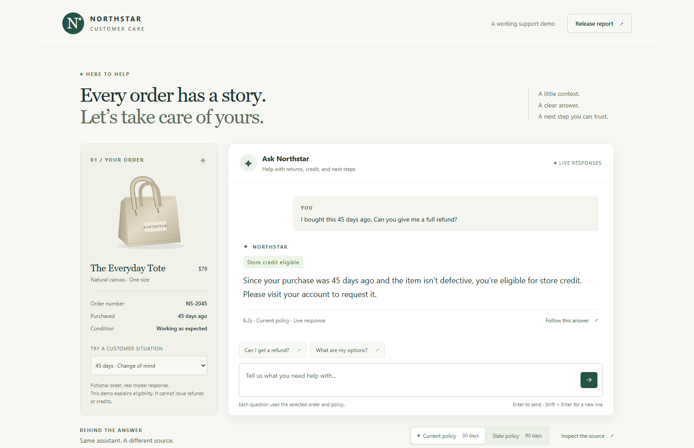

# The Northstar support app



The app is the opening scene of the workshop. It is a small web interface over `make_predictor` in `west_workshop/runtime.py`, the same traced function the notebooks evaluate. Orders are fictional, and every answer comes from a real model call.

The policy switch chooses which document the retriever returns: the current 30-day policy or the stale 90-day one. It is a deliberately small retrieval step, not a vector database. Each question is independent and includes the selected order's age and condition. The app explains eligibility and next steps. It cannot approve a payment, issue credit, or open a ticket.

## Try it

1. Keep **Current policy** selected and the **45 days · Change of mind** order. Click **Can I get a refund?**, then send.
2. Read the answer. Click **Follow this answer** to see the policy saved in this answer's retrieval span, with its trace ID.
3. Select **Stale policy**, click **Can I get a refund?** again, and send. Switching policies clears the previous answer and the message box, so an old answer cannot be mistaken for a new one.
4. Open **Release report** to see the recorded comparison across ten cases. A new chat answer is not part of that report. Until you [publish a report](#publish-a-recorded-report-to-the-app) to the app's experiment, this page says that none has been published yet.

## Run it locally

Finish the [local route](../README.md#local-route) first, then run this in the terminal where you loaded your API key:

```bash
uv run --locked python app.py
```

Open [http://127.0.0.1:8000](http://127.0.0.1:8000). The app uses the same SQLite database and experiment as the checkpoints. With the MLflow UI from the README running on port 5000, the **Follow this answer** panel includes an **Open this trace in MLflow** link to the answer's trace. Stop the app with Ctrl+C.

## Deploy it on Databricks Free Edition

This is optional. The presenter shows a hosted app in the opening, and every notebook works without one.

Finish the [Databricks route](../README.md#databricks-free-edition-route) and run chapter 4 first. Then add a cell at the end of `04_compare_and_gate`, where the workshop package is already set up, and run it to prepare the app's storage:

```python
from west_workshop.prepare_databricks_app import prepare
app_storage = prepare()
print(app_storage)
```

`prepare()` uses the catalog named `workspace` by default. It creates a `northstar_support` schema and a `reports` volume in that catalog, and a separate `/Users/<your-user>/northstar-support` experiment whose artifacts live in that volume. It reuses them on later calls and does not change your notebook's experiment. Pass `prepare(catalog="your_catalog")` if your writable catalog has another name.

Open the app switcher, select **Databricks Apps**, click **Create app**, and choose **Create a custom app**. Name it, for example `northstar-support`, and deploy from this public repository on branch `main`, where `app.py`, `app.yaml`, and `requirements.txt` live at the root. Add three app resources with these exact keys:

| Resource key | Resource | Permission |
|---|---|---|
| `serving-endpoint` | The chat endpoint your notebooks use | Can query |
| `experiment` | The `experiment_name` printed by `prepare()` | Can edit |
| `report-storage` | The Unity Catalog volume printed as `volume` | Can read and write |

`app.yaml` reads the first two keys into `WORKSHOP_DATABRICKS_MODEL` and `MLFLOW_EXPERIMENT_ID`. The volume resource grants storage access only. Its path is already recorded as the experiment's artifact location. The app runs as its own service principal, so notebook permissions do not carry over, and no personal token belongs in its configuration. See [model resources](https://docs.databricks.com/aws/en/dev-tools/databricks-apps/model-serving), [experiment resources](https://docs.databricks.com/aws/en/dev-tools/databricks-apps/mlflow), [volume resources](https://docs.databricks.com/aws/en/dev-tools/databricks-apps/uc-volumes), and [Git deployment](https://docs.databricks.com/aws/en/dev-tools/databricks-apps/deploy).

The app uses a volume-backed experiment because, during testing on Free Edition, the default MLflow-managed artifact storage was unreachable from Apps. Artifacts in a [Unity Catalog volume](https://docs.databricks.com/aws/en/mlflow/experiments) keep the usual MLflow trace view.

After deployment, open the app URL and send a question. Each answer links to its exact trace. The app answers one request at a time, which keeps the demo within a shared endpoint's limits. Free Edition allows up to three apps per account and stops each app 24 hours after it is started, updated, or redeployed. Everyone who opens the app must belong to the same Databricks account, so each attendee deploys their own copy. See [Free Edition limits](https://docs.databricks.com/aws/en/getting-started/free-edition-limitations) and [app access](https://docs.databricks.com/aws/en/dev-tools/databricks-apps/key-concepts).

To pick up a newer version of this repository, deploy the app again. During testing, a redeploy of a running app kept the packages it had installed before, because `requirements.txt` itself had not changed. It only points to `requirements-workshop.txt`. When the pinned versions change, stop the app and start it again so it installs them fresh.

## Publish a recorded report to the app

Publishing copies a saved chapter 4 summary into the app's experiment. It makes no model calls and does not change any score or decision.

Locally:

```bash
uv run --locked python -m west_workshop.publish_report "<summary_path>" --provider openai
```

Replace `<summary_path>` with the `summary.json` path from your chapter 4 run. Chapter 4 prints it after `Full saved results:`, whether you ran the chapter file or the `--checkpoint 4` command.

In Databricks, add a new cell at the end of `04_compare_and_gate` and run it after the comparison finishes. `prepare()` reuses the storage it created earlier.

```python
from west_workshop.publish_report import publish
from west_workshop.prepare_databricks_app import prepare
publish(summary["summary_path"], provider="databricks", experiment_id=prepare()["experiment_id"])
```

**Release report** opens the most recently published comparison, including a blocked or incomplete one. It never searches for a winning run. Publish again after you rerun chapter 4.

## When the app misbehaves

| Symptom | What to check |
|---|---|
| Deployment cannot find a resource | Use the exact keys `serving-endpoint` and `experiment`, and attach the `report-storage` volume. |
| The page loads but a question fails | The app identity needs Can query on the endpoint, Can edit on the experiment, and read and write on the volume. Then check endpoint availability and quota. |
| Another question is being answered | Wait for that request to finish, then retry. Nothing is queued or substituted. |
| A request times out | The page stops waiting after about three minutes, and the call may still be finishing. If the app stays busy, restart it and check its resources. |
| The release report is unavailable | Publish a chapter 4 summary into the experiment attached to this app. |
| The app has stopped | Restart it from Databricks Apps. Free Edition stops an app 24 hours after it is started, updated, or redeployed. |
